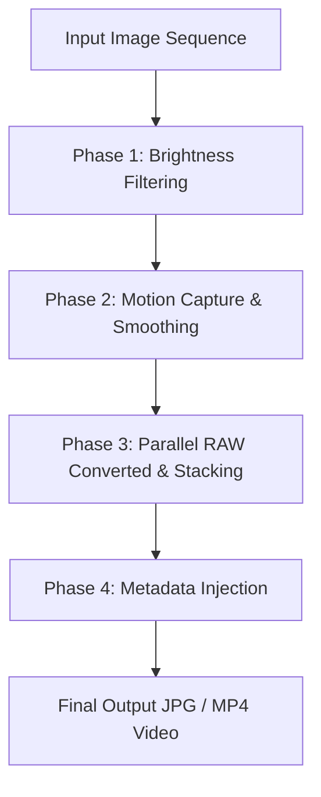

# Star Trail Stacker - Technical Implementation Details

This document outlines the technical architecture, mathematical methodologies, and execution pipeline of the Star Trail Stacker (`star_trail.py`).

---

## Technical Overview

The utility is a high-performance Python script designed to stack Sony RAW (`.ARW`) or standard image files (`.jpg`, `.png`, etc.) into star trail images using the **Lighten blend mode**. Beyond basic stacking, it resolves common real-world astrophotography challenges:
- **Wind Jitter & Shift**: Stabilizes ground landscapes or tracks celestial movement.
- **Varying Intervals**: Performs time-aware smoothing of camera motion.
- **Overexposed Frames**: Filters out frames contaminated by headlights, airplanes, or satellites.
- **Metadata Retention**: Injects original shooting metadata (camera model, lens, EXIF settings) back into the stacked output.

---

## Stacking Pipeline

The stacker operates in four distinct phases:



### Phase 1: Brightness Filtering
To prevent clouds, passing headlights, or satellites from ruining the stack:
1. **Parallel Mean Calculation**: The mean brightness of each frame is evaluated concurrently.
2. **Auto-Thresholding**: In `'auto'` mode, the script calculates a robust cutoff threshold based on clean (non-zero) frame statistics:
   $$\text{Threshold} = \text{Mean} + (0.5 \times \text{StdDev})$$
3. **Filtering**: Any frame exceeding this threshold is discarded from the list of files to process.

---

### Phase 2: Motion Capture & Stabilization
If stabilization (`--ground-stabilize` or `--star-stabilize`) is enabled, the program analyzes camera motion before rendering the final frames.

#### 1. Frame Alignment Logic
- **Ground Stabilization**:
  - Focuses on the bottom portion of the image (defaulting to the bottom 40%).
  - **Phase Correlation**: Detects sub-pixel translation (`dx`, `dy`) between consecutive frames.
  - **ORB + RANSAC** (Rotation): Detects rotation (`dangle`) using ORB feature match coordinates filtered via RANSAC.
- **Star Stabilization**:
  - Automatically identifies the brightest celestial spot (ignoring single hot pixels using a $15 \times 15$ Gaussian blur).
  - Tracks that star patch across frames using sub-pixel phase correlation inside a local $100 \times 100$ window.

#### 2. Detrending & Gaussian Smoothing
A simple Gaussian filter applied to cumulative motion curves creates boundary artifacts (edge curling/shrinkage) when a slow drift is present. To prevent this:
1. The motion curve is first **detrended** by fitting a 2nd-degree polynomial representing the macro-drift.
2. The detrended residual is padded using edge-extension and smoothed with a Gaussian kernel.
3. The macro-drift trend is added back.

```
       Cumulative Motion Path            Detrended residual              Smoothed Curve
       
          /                                 _/\_                            /
         /  _/\_                           /    \                          /  _--_
        /  /    \      ==[Detrend]==>     /      \     ==[Retrend]==>     /  /    \
       /  /                                                             /  /
      /                                                                /
```

#### 3. Time-Aware Weighting
When frame intervals vary (e.g., buffer pauses or battery swaps), frame-index-based smoothing leads to uneven motion representation. The stacker implements time-aware smoothing using EXIF timestamps:
$$\text{Weight}_j = \exp\left(-\frac{1}{2} \left(\frac{t_j - t_i}{\sigma}\right)^2\right)$$
where $\sigma$ is estimated from the average interval length and the frame smoothing radius.

#### 4. Rotation Validation
Rotational stabilization can occasionally introduce artifacts if feature matching is weak. The tool validates whether rotation improves alignment by comparing the **Sum of Squared Differences (SSD)** of edge pixels against center pixels on sample frames:
- If edge SSD decreases with rotation and center SSD does not degrade by $>1\%$, translation + rotation matrix mapping (`cv2.warpAffine`) is used.
- Otherwise, the program falls back to translation-only stabilization.

---

### Phase 3: Parallel Stacking & Rendering
Processing high-resolution RAW files is CPU-bound. To maintain optimal throughput:
1. **ThreadPoolExecutor**: Processes and decodes images in parallel.
2. **Threaded RAW Development**: Raw files are developed using `rawpy` parameters in parallel worker threads.
3. **Sequential Stacking**: Blended iteratively on the main thread using:
   $$\text{Stacked}[y, x] = \max(\text{Stacked}[y, x], \text{Frame}[y, x])$$
4. **Optional Video Generation**: If `--video` is requested, the growing stack state (or stabilized single frames) is written directly into an MP4 container (`mp4v` codec) at the specified FPS and resolution.

---

### Phase 4: Metadata Injection
Since processing through OpenCV/Pillow strips standard metadata headers:
1. **Exiftool Invocation**: The script runs `exiftool.exe` as a subprocess.
2. **Tag Copying**: It copies all tags (excluding thumbnail IFD1 tags to prevent corruption) from the last original image in the sequence to the final output file:
   ```bash
   exiftool -TagsFromFile source.ARW -All:All --IFD1:All -overwrite_original final_output.jpg
   ```

---

## Core Configuration Reference

| Option | Command Line Flag | Default | Description |
| :--- | :--- | :--- | :--- |
| Ground Lock | `--ground-stabilize` | Disabled | Anchors the landscape to eliminate wind-jitter. |
| Star Lock | `--star-stabilize` | Disabled | Rotates & translates around the celestial pivot. |
| Smoothing Radius | `--smooth <int>` | 1.0 * Length | Standard/Time-aware Gaussian kernel radius. |
| Brightness Limit | `--brightness-limit <val>`| `'auto'` | Max acceptable mean brightness (filters out headlights). |
| Threads | `--threads <int>` | CPU Count | Number of concurrent image processing threads. |
| Video Export | `--video [trail/no-trail]` | Disabled | Exports stacking progression as `.mp4`. |
